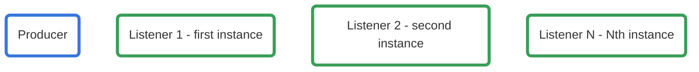
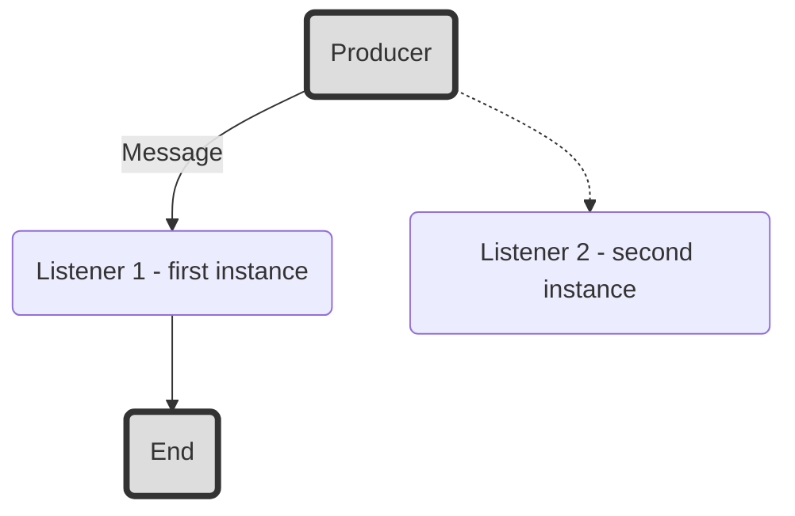
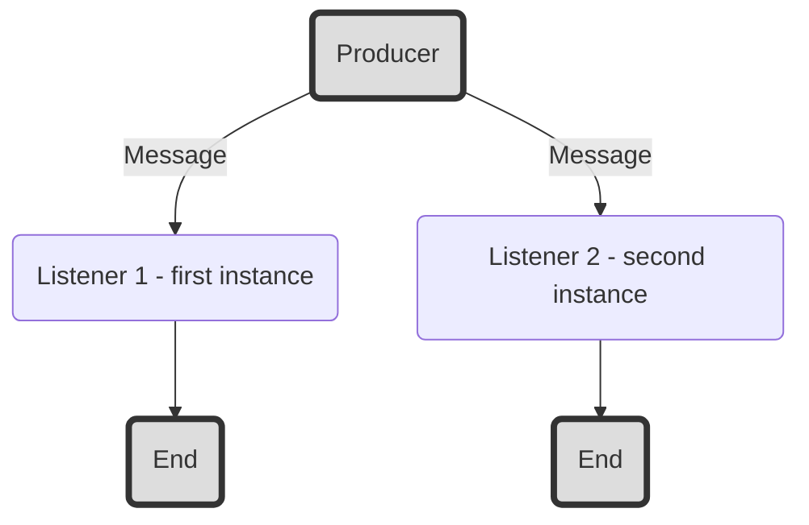

Go common
===

## Table of Contents

* [Go common](#go-common)
  * [Table of Contents](#table-of-contents)
  * [AMQP connection provider](#amqp-connection-provider)
  * [Queue](#queue)
    * [Listener Handler](#listener-handler)
      * [Handler](#handler)
    * [One message for one worker](#one-message-for-one-worker)
      * [Initialization](#initialization)
    * [One message for all workers](#one-message-for-all-workers)
      * [Initialization](#initialization-1)
    * [Producer](#producer)
      * [Connection](#connection)
      * [Emitter](#emitter)

AMQP connection provider
---

Interface github.com/tontechio/go-common/blob/master/pkg/amqp/common.go

```gherkin=
import (
    "github.com/tontechio/go-common/pkg/amqp"
)

// ...

amqpConnectionProvider, err := amqp.NewConnectionProvider(
    settings.Amqp.Host,
    settings.Amqp.Port,
	settings.Amqp.Username,
	settings.Amqp.Password,
	settings.Amqp.Vhost,
	logger
)

cmd.DieIfError(err, "amqpConnectionProvider init error", logger)

// ...
```


Queue
---

Because every instance in our infrastructure have duplicate we have 2 work flows for it.



### Listener Handler
Handle - its program for processing messages. It have common interface for both types queues.

#### Handler

```gherkin=
package myhandler

import (
    "encoding/json"
    "github.com/pkg/errors"

    "github.com/tontechio/go-common/pkg/queue"
)

// message description
type MyMessage struct {
    Payload string `json:"payload"`
}

type myHandler struct {
    logger        *zap.Logger
    emailProducer queue.Producer
}

func (h *myHandler) HandleMessage(msg []byte) error {
    message := MyMessage{}

    err := json.Unmarshal(msg, &message)
    if err != nil {
        return errors.Wrap(err, "Can not unmarshal message")
    }

    h.logger.Debug("Have message", zap.Any("message", params))

    return nil
}

func NewMyHandler(logger *zap.Logger) (queue.MessageHandler, error) {
	if logger == nil {
		return nil, errors.New("NewMyHandler, empty logger")
	}

	return &myHandler{
		logger:        logger,
	}, nil
}


```

### One message for one worker


This is common flow used in most cases, for example Email service, or Mixpanel Service. Message will delivered to one listener. Other listeners ignore it.



#### Initialization

```gherkin=
package main

import (
    "github.com/tontechio/go-common/pkg/queue"

    "myhandler"
)

// ...

myListener, err := queue.NewListener(
    amqpConnectionProvider
    "my.exchange.name",
    queue.DeliveryToOneOfAllListeners,
    "my.queue.name",
    logger,
)

// ...

myHandler, err := myhandler.NewMyHandler(logger)

// ...

quitCh := make(<-chan bool)

err = myListener.Listen(myHandler)

<-quitCh


// ...
```

### One message for all workers


This case used for example in socket service. We need send message to `all` workers for processing.



#### Initialization

```gherkin=
package main

import (
    "github.com/tontechio/go-common/pkg/queue"

    "myhandler"
)

// ...

myListener, err := queue.NewListener(
    amqpConnectionProvider
    "my.exchange.name",
    queue.DeliveryToAllListeners,
    "", // must be empty, because every instance creates new auto-generated queue
    logger,
)

// ...

myHandler, err := myhandler.NewMyHandler(logger)

// ...

quitCh := make(<-chan bool)

err = myListener.Listen(myHandler)

<-quitCh


// ...
```

### Producer
Producer creates message and put it into amqp.

#### Connection
```gherkin=
package main

import (
    "github.com/tontechio/go-common/pkg/queue"
)


myProducer, err := queue.NewProducer(
    amqpConnectionProvider,
    "my.exchange.name",
    "my.queue.name", // Should be empty if type == queue.DeliveryToAllListeners
    logger,
)
// ...

err = myProducer.Connect()

// ...

```

#### Emitter
After initialization use this producer for send messages:

```gherkin=


// ...

// message description
type MyMessage struct {
    Payload string `json:"payload"`
}

message := MyMessage{
    Payload: "Some payload",
}

// ...

err := myProducer.EmitMessage(message)

// ...

```
